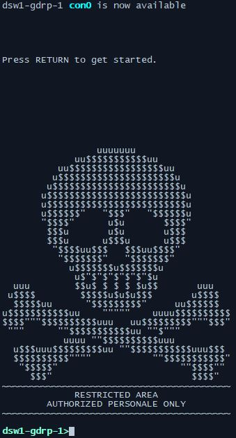

                     )  (
        )         ( /(  )\ )  
       (      (   )\())(()/(  
       )\  '  )\ (_))/  ((_)) 
     _((_))  ((_)| |_   _| |  
    | '  \()/ _ \|  _|/ _` |  
    |_|_|_| \___/ \__|\__,_|  

# motd

Collaboration project to create a network device 'message of the day' generator web app.

## Plan:

- React front-end to easily create motd templates for applying them to a device
- Python backend with RestAPI for creating templates with desired inputs
- Jinja2 template engine for generating the text config
- Learn from this project as a foundation for other collaboration projects with Python and React

## Examples

